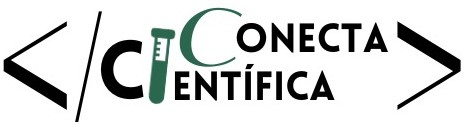
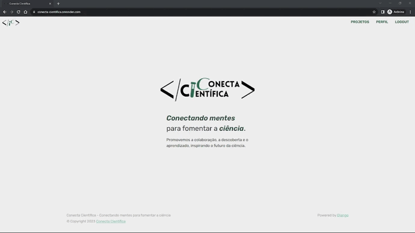

  

  

# Conecta Científica

O Conecta Científica é uma plataforma dedicada a otimizar a conexão entre alunos e professores interessados em se envolver em projetos de iniciação científica.

 

## Funcionalidades Principais

1. **Criação de Perfil**
   - Professores e alunos podem criar perfis detalhados para destacar suas habilidades, interesses e experiências.

2. **Publicação de Projetos de Iniciação Científica (IC)**
   - Professores podem postar detalhes sobre projetos de IC em que estão envolvidos, incluindo descrição, requisitos e prazos.

3. **Procura de Projetos**
   - Alunos podem explorar projetos disponíveis com base em suas áreas de interesse, professor, universidade, facilitando a busca por oportunidades relevantes.

4. **Recomendações de Projeto usando IA**
   - Um sistema de recomendação baseado em IA ajuda a sugerir projetos aos alunos com base em seus perfis.

5. **Inscrição em Projetos**
   - Alunos podem se inscrever em projetos e professores podem ou não aceitar as inscrições diretamente pela plataforma, proporcionando uma gestão eficiente e simplificada do processo de seleção.

 

## Tecnologias Utilizadas

- **Linguagens, Frameworks e Bibliotecas:**
  - Python - Django, SKLearn, SpaCy, Numpy
  - HTML5, CSS3, JS - Bootstrap 5

- **Banco de Dados:**
  - MySQL, AWS

- **Ferramenta de Integração:**
  - GitHub

- **Hospedagem:**
  - Render

 

## Demonstração visual do Conecta Científica

**1. Criação de perfil e login:**

**2. Edição do perfil e acesso a outros perfis:**

**3. Criação de projeto:**

**4. Edição de projeto:**

**5. Sistema de recomendação e tags:**

**6. Inscrição em projeto e filtros:**

**7. Aprovar ou reprovar inscrições:**

 

## Como Acessar

Acesse o Conecta Científica através do seguinte endereço:

[https://conecta-cientifica.onrender.com/](https://conecta-cientifica.onrender.com/)
